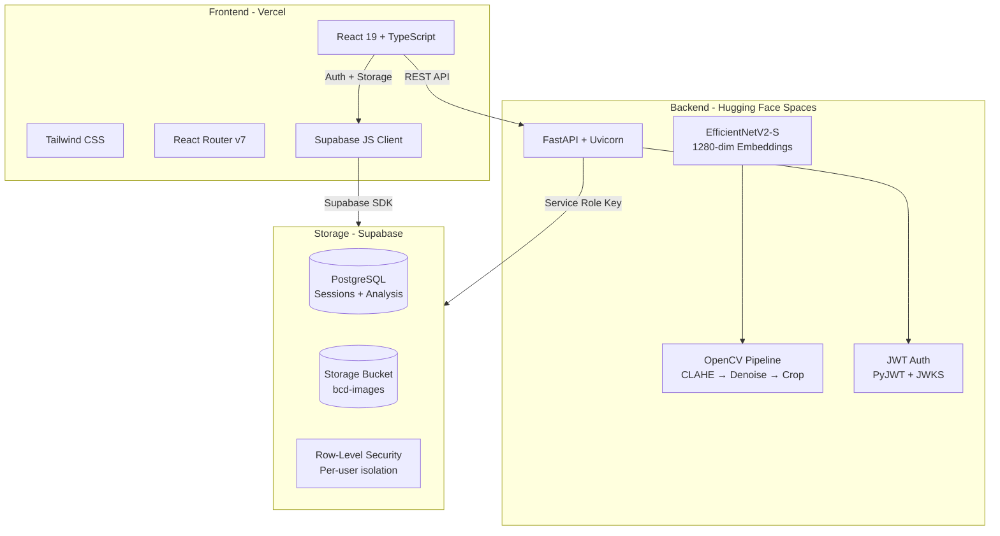
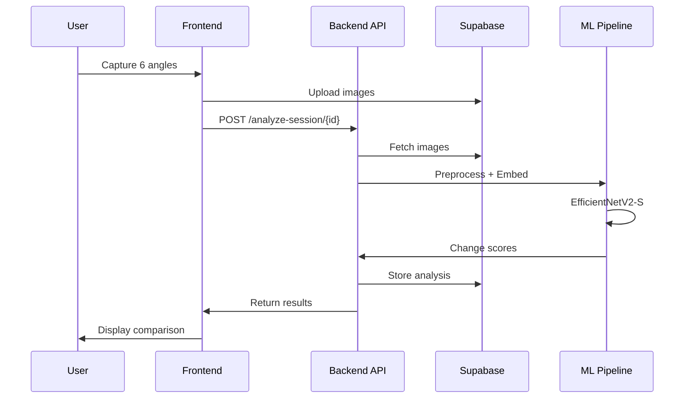

# BCD - Breast Changes Detection

<p align="center">
  
</p>

[](https://github.com/muneer406/BCD/actions/workflows/ci.yml)
[](https://react.dev)
[](https://www.typescriptlang.org/)
[](https://fastapi.tiangolo.com/)
[](https://supabase.com)
[](https://pytorch.org/)
[](LICENSE)
[](https://vercel.com)
[](https://huggingface.co/spaces)

> **A privacy-first visual change awareness tool** that helps individuals track breast health changes over time through standardized self-monitoring. Compares you against your own history - not population averages.

⚠️ **Disclaimer:** This is an **awareness tool**, NOT a medical diagnostic device. It does not detect disease or replace professional medical care. Always consult healthcare professionals for medical concerns.

---

## 📋 Table of Contents

- [What is BCD?](#-what-is-bcd)
- [Architecture](#-architecture)
- [How It Works](#-how-it-works)
- [Tech Stack](#-tech-stack)
- [Getting Started](#-getting-started)
- [Project Structure](#-project-structure)
- [Privacy & Security](#-privacy--security)
- [API Overview](#-api-overview)
- [Documentation](#-documentation)
- [Contributing](#-contributing)
- [License](#-license)

---

## 🎯 What is BCD?

BCD provides a **structured, consistent framework** for visual self-monitoring, bridging the gap between irregular self-checks and clinical screenings.

| Purpose | Benefit |
|---|---|
| **Monitor** visual changes | Consistent photo documentation over time |
| **Compare** with personal history | 6-angle standardized captures |
| **Detect** subtle changes | ML-powered comparison against your baseline |
| **Decide** on professional consultation | Data-driven awareness |

### Use Cases

| Scenario | Frequency | Benefit |
|---|---|---|
| **Regular monitoring** | Monthly | Establish personal baseline, track normal changes |
| **Post-surgery follow-up** | Weekly/Bi-weekly | Monitor healing and recovery progress |
| **Family history concerns** | Bi-weekly | Early awareness for higher-risk individuals |
| **Between clinical appointments** | Monthly | Maintain awareness during 6–12 month gaps |

---

## 🏗 Architecture



### Data Flow



---

## 📸 How It Works

### The Process

```
Sign Up → Accept Disclaimer → Capture 6 Angles → Save Session → ML Analysis → Compare History
```

### 6-Angle Capture Protocol

Each session requires captures from **all 6 standardized angles**:

| Angle | Position | Purpose |
|---|---|---|
| **Front view** | Arms at sides, shoulders relaxed | Baseline symmetry reference |
| **Left side** | 90° turn, steady posture | Left side profile |
| **Right side** | 90° turn, steady posture | Right side profile |
| **Upward angle** | Camera below, tilted up | Underside perspective |
| **Downward angle** | Camera above, tilted down | Top-down view |
| **Full body** | Step back for full torso | Overall proportions |

**Pro Tip:** Capture **multiple images per angle** - the system uses all images for comparison, improving reliability.

---

## 🛠 Tech Stack

### Frontend

| Technology | Version | Purpose |
|---|---|---|
| React | 19 | UI library |
| TypeScript | 5.9 | Type safety |
| Vite | 7 | Build tool & dev server |
| Tailwind CSS | 3 | Utility-first styling |
| React Router | 7 | Client-side navigation |
| Supabase JS | 2 | Auth & storage client |
| Lucide React | 0.564 | Icon library |

### Backend

| Technology | Version | Purpose |
|---|---|---|
| Python | 3.11 | Runtime |
| FastAPI | 0.110 | Web framework |
| PyTorch | 2.1 | ML inference (EfficientNetV2-S) |
| OpenCV | 4.8 | Image preprocessing (CLAHE, denoise, crop) |
| Supabase Python | 2.10 | Database & storage client |
| PyJWT | 2.8 | JWT verification (JWKS) |
| SlowAPI | 0.1 | Rate limiting |

### Hosting

| Component | Platform |
|---|---|
| Frontend | [Vercel](https://vercel.com) |
| Backend | [Hugging Face Spaces](https://huggingface.co/spaces) (Docker) |
| Database | [Supabase](https://supabase.com) PostgreSQL |
| Storage | Supabase Storage (S3-compatible, private bucket) |

---

## 🚀 Getting Started

### For Users

1. Visit the **[web app](https://bcd-dev.vercel.app)**
2. Sign up with email/password
3. Read and accept the disclaimer
4. Capture your first session (6 angles)
5. Return monthly to compare progress

### For Developers

#### Frontend

```bash
# Clone repository
git clone https://github.com/muneer406/BCD.git
cd BCD/frontend

# Install dependencies
npm install

# Configure environment
cp .env.example .env.local
# Add your Supabase credentials (URL + anon key)

# Run development server
npm run dev
```

#### Backend

```bash
cd BCD/backend

# Create virtual environment
python -m venv .venv
source .venv/bin/activate  # Linux/Mac
.venv\Scripts\activate     # Windows

# Install dependencies
pip install -r requirements.txt

# Configure environment
cp .env.example .env
# Add SUPABASE_URL and SUPABASE_SERVICE_ROLE_KEY

# Run server
uvicorn app.main:app --reload
```

#### Full Stack (Docker)

```bash
cd BCD/backend
docker compose up --build
# Frontend: http://localhost:5173
# Backend:  http://localhost:8000
# API Docs: http://localhost:8000/api/docs
```

---

## 📁 Project Structure

```
BCD/
├── frontend/                          # React + TypeScript UI (Vercel)
│   ├── src/
│   │   ├── components/                # Reusable UI (Button, Card, ErrorBoundary, etc.)
│   │   ├── pages/                     # Route pages (Capture, History, Result, etc.)
│   │   ├── context/                   # Auth, Draft, SessionCache providers
│   │   ├── lib/                       # API client, Supabase client, constants
│   │   └── data/                      # Static data (capture steps)
│   ├── public/                        # Static assets (logo)
│   ├── Dockerfile                     # Production container
│   ├── tailwind.config.js
│   └── package.json
│
├── backend/                           # FastAPI + ML pipeline (HF Spaces)
│   ├── app/
│   │   ├── api/                       # Route handlers (thin controllers)
│   │   ├── services/                  # Business logic, ML pipeline, DB access
│   │   ├── processing/                # Preprocessing, embeddings, quality scoring
│   │   └── utils/                     # JWT verification, input validation
│   ├── tests/                         # pytest suite (55+ tests)
│   ├── scripts/                       # Migration runner
│   ├── Dockerfile                     # Multi-stage CPU-only PyTorch
│   ├── docker-compose.yml
│   └── requirements.txt
│
├── .github/workflows/                 # CI/CD (tests + HF Spaces sync)
├── SUPABASE_MIGRATIONS.sql            # Database schema + RLS policies
├── SECURITY.md                        # Security & privacy documentation
└── README.md
```

---

## 🔐 Privacy & Security

| Feature | Implementation |
|---|---|
| **Authentication** | Supabase Auth with email/password |
| **API Authorization** | JWT verification via JWKS (ES256) |
| **Data Isolation** | Row-Level Security (RLS) on all tables |
| **Image Storage** | Private Supabase bucket, signed URLs (5 min expiry) |
| **Access Control** | Users can only see/delete their own data |
| **Encryption** | HTTPS in transit, encrypted at rest |
| **CORS** | Explicit allow-list required in production |
| **CSP** | Content-Security-Policy headers on frontend + backend |
| **Rate Limiting** | Per-endpoint (analysis: 20/day, utility: 30/min, auth: 5/hr) |
| **Input Validation** | UUID format + image type validation on all endpoints |

**Privacy Promise:** Your images are stored securely, never shared, and completely isolated from other users. You own your data. Session and data deletion is available from the History page.

---

## 📡 API Overview

| Endpoint | Method | Auth | Rate Limit | Purpose |
|---|---|---|---|---|
| `/health` | GET | No | - | Health check |
| `/api/analyze-session/{id}` | POST | Yes | 20/day | Run ML analysis on session |
| `/api/analyze-status/{id}` | GET | Yes | - | Poll async analysis status |
| `/api/compare-sessions/{c}/{p}` | POST | Yes | - | Compare two sessions |
| `/api/session-info/{id}` | GET | Yes | 30/min | Session metadata |
| `/api/image-preview/{id}/{type}` | GET | Yes | 30/min | Signed image URLs |
| `/api/session-thumbnails/{id}` | GET | Yes | 30/min | Batch image previews |
| `/api/delete-session/{id}` | DELETE | Yes | - | Delete session + all data |
| `/api/sessions/{id}/analysis` | GET | Yes | - | Read stored analysis |
| `/api/generate-report/{id}` | POST | Yes | - | Report (stub) |
| `/api/docs` | GET | No | - | Interactive API docs (Swagger) |

Full documentation: **[BACKEND_DOCS.md](backend/BACKEND_DOCS.md)**

---

## 📖 Documentation

| Guide | Description |
|---|---|
| **[BACKEND_DOCS.md](backend/BACKEND_DOCS.md)** | Complete backend reference - setup, API, ML pipeline, deployment |
| **[frontend/README.md](frontend/README.md)** | Frontend setup and development |
| **[backend/README.md](backend/README.md)** | Backend quick-start |
| **[SUPABASE_MIGRATIONS.sql](SUPABASE_MIGRATIONS.sql)** | Database schema with RLS policies |
| **[SECURITY.md](SECURITY.md)** | Security practices and privacy roadmap |
| **[API Docs](http://localhost:8000/api/docs)** | Interactive Swagger UI (local dev) |

---

## 🧪 Testing

```bash
# Backend tests (55+ tests, all external deps mocked)
cd backend
pytest tests/ -v

# Frontend type check + lint
cd frontend
npx tsc -b --noEmit
npm run lint
```

---

## 🤝 Contributing

Contributions welcome! Please:

1. Follow the existing code style
2. Maintain neutral, non-diagnostic language (enforced by tests)
3. Test thoroughly with multiple users
4. Update documentation
5. All commits should reference the issue number

---

## 📜 License

MIT License - see [LICENSE](LICENSE) for details.

---

## 🙏 Acknowledgments

Built with:

- [Supabase](https://supabase.com) - Open-source Firebase alternative
- [PyTorch](https://pytorch.org) - ML framework
- [FastAPI](https://fastapi.tiangolo.com) - Python web framework
- [React](https://react.dev) - UI library
- [Tailwind CSS](https://tailwindcss.com) - CSS framework
- [Hugging Face Spaces](https://huggingface.co/spaces) - ML deployment

---

**Making breast health awareness accessible, one session at a time.** 🎗️
